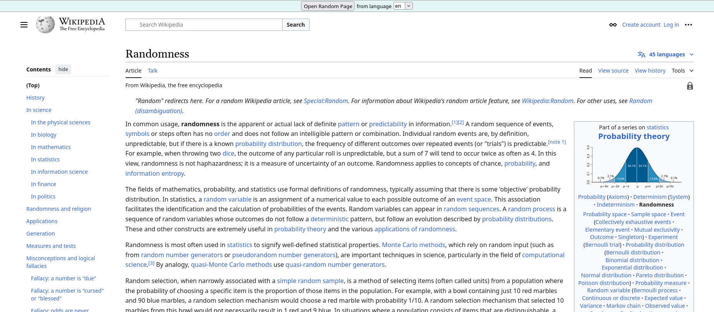

# Random Wikipedia Page

Opens a random Wikipedia page in an iframe for easy re-rolling of pages.

## Usage

1. Open [Random Wikipedia Page](https://kuuuube.github.io/random-wikipedia-page).

2. Select your desired language using the dropdown or enter the [WP code](https://en.wikipedia.org/wiki/List_of_Wikipedias#Wikipedia_editions) to use any wikipedia.

3. (Optional) Set `Category` or `Max page rank` (only available in some languages).

4. Click `Open Random Page`.

## Screenshot

## Credits

Thanks to [Gary Stephens](https://github.com/garystephens) for the original code at [RandomWikipediaPage](https://github.com/garystephens/RandomWikipediaPage).
